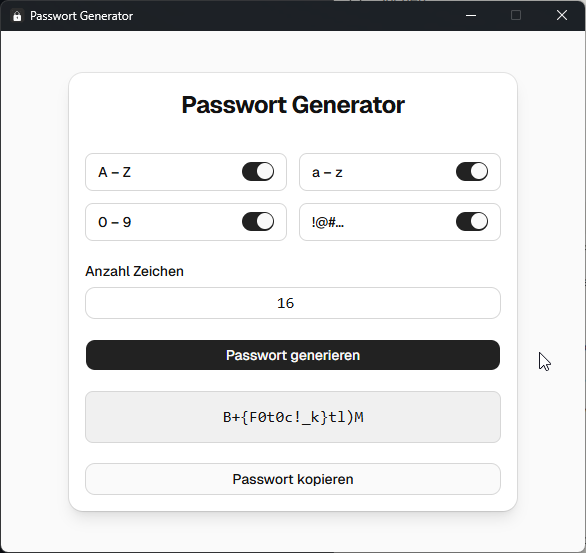

# Passwort Generator

Ein einfacher, moderner Passwort-Generator mit grafischer Benutzeroberfläche, gebaut mit Python und [CustomTkinter](https://github.com/TomSchimansky/CustomTkinter).



## Features

- **Konfigurierbare Zeichensätze** – Großbuchstaben (A–Z), Kleinbuchstaben (a–z), Ziffern (0–9) und Sonderzeichen (!@#…) einzeln ein-/ausschaltbar
- **Frei wählbare Passwortlänge** – beliebige Anzahl an Zeichen
- **Dark/Light Mode** – umschaltbares Erscheinungsbild
- **Passwort kopieren** – generiertes Passwort mit einem Klick in die Zwischenablage kopieren

## Installation

### Option 1: Fertige EXE (Windows)

Die aktuelle `.exe` kann direkt von den [Releases](../../releases) heruntergeladen und ohne Installation gestartet werden.

### Option 2: Aus dem Quellcode

```bash
# Repository klonen
git clone https://github.com/stp07/Passwort-Generator.git
cd Passwort-Generator

# Abhängigkeiten installieren
pip install -r requirements.txt

# Starten
python password_xy_1.2.py
```

## Abhängigkeiten

- Python 3.8+
- [CustomTkinter](https://github.com/TomSchimansky/CustomTkinter) >= 5.0

## Lizenz

MIT
